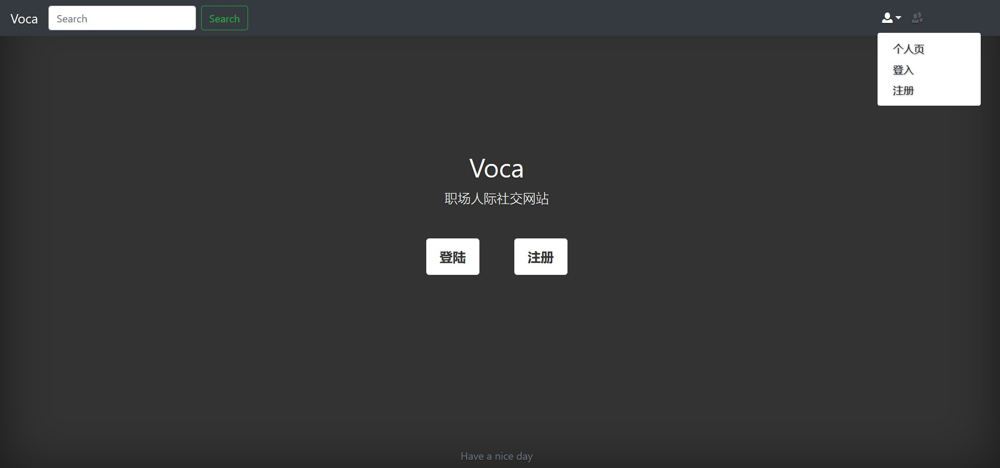
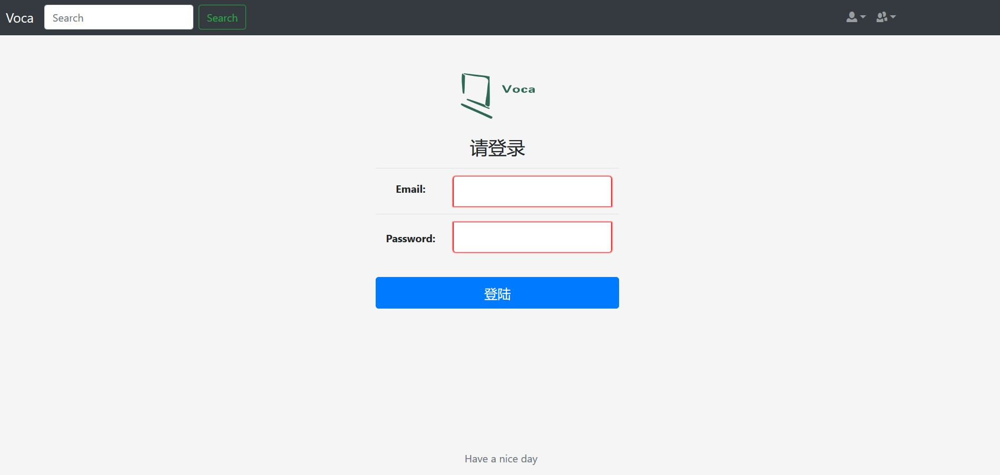
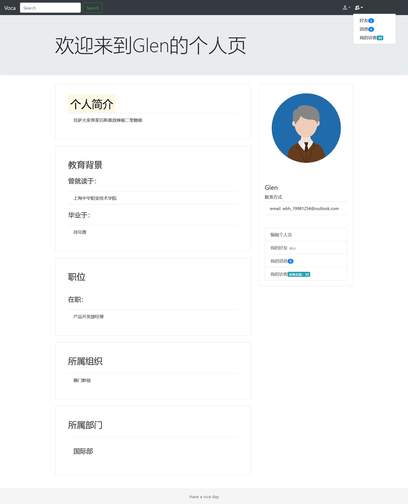

# VOCA

This is a social networking website with a variety of functionalities, including user account management, friend system, visitor system, message system, search and a handy administration system.



The picture above presents you the main page of our website.



This is the login page.



This is the your personal page.

## Getting Started

These instructions will get you a copy of the project up and running on your local machine for development and testing purposes. See deployment for notes on how to deploy the project on a live system.

### Prerequisites

Make sure you have Python 3.6 in your PATH and installed MYSQL 8.0.

### Installing

First Clone this repository to your machine.

```
git clone  https://github.com/GlenGGG/voca.git
cd voca
```

Then install all the dependencies.

```
pip install -r requirements.txt
```

Then create a database in MYSQL and name it 'voca_rdb'. There are some useful scripts in 'voca/src/voca/vocal_rdb_mysql_scripts'. You can setup tables and load data through these scripts. 

Finally, now you can run the website.

```
cd src/voca
python manage.py runserver 127.0.0.1:8888
```

Open your browser and you should be able to see the main page on 127.0.0.1:8888 .

## Built With

* [Django](https://docs.djangoproject.com/en/1.11/) - The web framework used
* [MySQL](https://dev.mysql.com/doc/refman/8.0/en/) - The database used
* [Bootstrap](https://getbootstrap.com/) - Used to beautify our website
